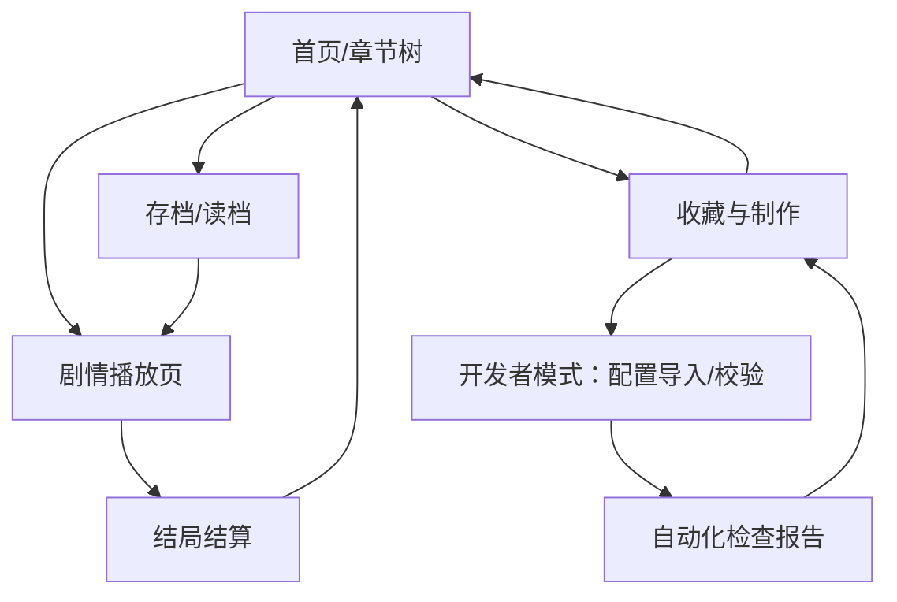

## 1. Product Overview
将现有项目升级为“抖音小游戏可上线”的视觉小说（Visual Novel）叙事产品，以章节树驱动剧情播放、分支选择与多结局收集。
面向普通玩家提供沉浸式短时游玩与可回溯探索；面向内容同学提供基于表格配置的高效率产出与校验。

## 2. Core Features

### 2.1 User Roles
| 角色 | 获取方式 | 核心权限 |
|------|----------|----------|
| 玩家 | 直接进入小游戏 | 浏览章节树、游玩剧情、选择分支、回溯、存档/读档、收集结局 |
| 内容/测试人员（内置开发者入口） | 在设置页使用特定手势/口令进入 | 导入/预览配置、校验章节树、查看资源引用、运行自动化检查报告 |

### 2.2 Feature Module
产品最小可行版本包含以下页面：
1. **首页/章节树**：章节列表、章节树可视化、分支/条件/隐藏提示、存档入口、基础设置。
2. **剧情播放页**：对话/立绘/背景/音频播放、选项选择、条件判断、回溯（Rollback）、自动/快进、结算与结局入库。
3. **收藏与制作（含开发者模式）**：结局图鉴、章节进度；开发者模式下提供Excel模板下载说明、配置导入与校验、资源规范清单、自动化测试脚本运行指引。

### 2.3 Page Details
| Page Name | Module Name | Feature description |
|-----------|-------------|---------------------|
| 首页/章节树 | 章节树可视化 | 展示章节→场景→节点的树/图结构；标记“已解锁/未解锁/隐藏/可回溯点”；支持按章节筛选与快速继续 |
| 首页/章节树 | 条件与隐藏提示 | 按条件表达式决定节点/分支是否可见/可选；对隐藏内容仅显示“？？？”并在满足条件后显形 |
| 首页/章节树 | 存档入口 | 展示多槽存档（至少3槽）与自动存档；支持一键继续上次 |
| 首页/章节树 | 基础设置 | 音量/震动/文本速度/自动播放速度/跳过已读；提供“开发者入口”触发区 |
| 剧情播放页 | 剧情渲染 | 按脚本播放对白、旁白、背景、立绘、转场与音效；支持角色名、表情/姿态切换、文本框样式 |
| 剧情播放页 | 分支选择 | 展示选项并在点击后写入“变量/标记”；支持选项条件（灰置/隐藏）与权重随机选项（可配置） |
| 剧情播放页 | 条件系统 | 读取变量与存档状态，执行if/else、set、add、flag、jump等基础指令，驱动剧情跳转 |
| 剧情播放页 | 回溯（Rollback） | 允许回退到上一个可回溯点：恢复文本、画面、变量与音频状态；对不可回溯节点（如随机抽卡/强制结算）给出提示 |
| 剧情播放页 | 自动/快进与已读 | 自动播放与快进；快进仅对已读内容生效（按nodeId记忆） |
| 剧情播放页 | 结局结算 | 触发结局节点时记录结局ID、时间、关键变量快照；展示结局卡并引导回章节树 |
| 收藏与制作 | 结局收藏 | 九宫格/列表展示已收集结局、解锁条件提示、重复结局的差分文案；支持一键回到对应章节起点 |
| 收藏与制作 | 进度与成就（可选但推荐） | 展示章节完成度、结局完成度、分支探索度；用于驱动隐藏内容解锁条件 |
| 收藏与制作 | Excel配置模板（说明） | 提供“模板字段定义、示例行、约束规则、导出JSON字段映射”的说明（用于内容生产，不影响玩家端） |
| 收藏与制作 | 资源规范清单 | 明确图片/音频/字体/脚本命名规则、分辨率/码率/大小预算、引用方式与目录结构 |
| 收藏与制作 | 自动化检查报告 | 展示/导出：章节树连通性、死路节点、循环检测、条件不可达、资源缺失/冗余、分包体积预算超限 |

## 3. Core Process
**玩家流程**：进入首页→在章节树选择章节→进入剧情播放→进行选择与条件分支→使用回溯探索不同分支→达成结局→结局入库→返回章节树继续解锁/收集。

**内容/测试流程（开发者模式）**：进入收藏与制作→查看Excel配置模板字段→导入/替换配置（开发态）→一键运行校验→查看资源规范与引用报表→触发自动化测试脚本→生成可提交的分包与清单。

