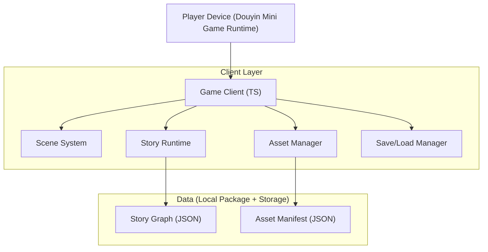
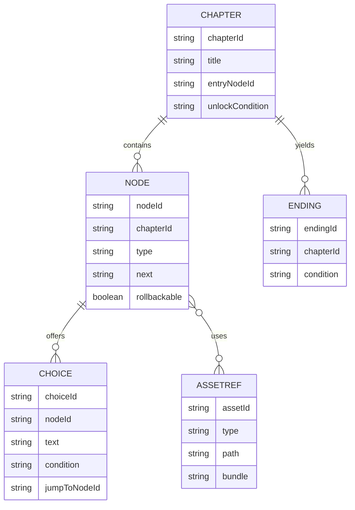

## 1.Architecture design

## 2.Technology Description
- Frontend: TypeScript + 小游戏渲染层（Canvas/WebGL）+ 轻量UI组件封装（自研组件化：TextBox/ChoiceList/ChapterGraph）
- Backend: None
- Data: 配置JSON（由Excel导出） + 本地资源（图片/音频） + 本地存档（平台Storage API/等价localStorage封装）
- Tooling（研发侧）: Node.js 脚本（配置导出/校验/资源清单/分包预算）+ 单元测试框架（Vitest/Jest二选一）

## 3.Route definitions
> 小游戏以“场景”代替传统Web路由。

| Route/Scene | Purpose |
|-------|---------|
| /boot | 启动加载、分包预取策略、读取存档与基础设置 |
| /home | 章节树主页、继续游戏、设置入口 |
| /player | 剧情播放、分支选择、回溯、结算 |
| /collection | 结局图鉴、进度统计、跳转回章节 |
| /settings | 音量/文本速度/跳过已读/开发者入口 |
| /dev (guarded) | 配置校验、资源规范清单、自动化检查报告展示 |

## 4.API definitions (If it includes backend services)
- Backend: None（不提供HTTP API）。

## 6.Data model(if applicable)
### 6.1 Data model definition
**核心配置对象（逻辑外键，不使用物理外键约束）**：
- Chapter：章节（chapterId, title, entryNodeId, unlockCondition）
- Node：剧情节点（nodeId, chapterId, type, content, next, rollbackable, tags）
- Choice：选项（choiceId, nodeId, text, condition, effects, jumpToNodeId）
- Ending：结局（endingId, name, condition, rewardTags）
- AssetRef：资源引用（assetId, type, path, bundle, hash, size）

### 6.2 Data Definition Language
不使用数据库；以“Excel→JSON”导出产物作为运行时数据。

**Excel配置模板（建议拆为多个Sheet）**
1) Sheet: chapters
- chapterId（必填，唯一）
- title
- entryNodeId（必填）
- unlockCondition（可选，例如：flag("E1_UNLOCK") && endingCount>=2）
- bundle（所属分包名）

2) Sheet: nodes
- nodeId（必填，唯一）
- chapterId（必填）
- type（dialog/narration/choice/jump/ending）
- speaker（可选）
- text（可选）
- bgAssetId / charAssetId / sfxAssetId / bgmAssetId（可选）
- next（默认跳转）
- rollbackable（0/1）
- tags（逗号分隔，用于埋点/推荐/隐藏线提示）

3) Sheet: choices
- choiceId（必填，唯一）
- nodeId（必填）
- text（必填）
- condition（可选）
- effects（可选，形如：set(flagA,1);add(score,2)）
- jumpToNodeId（必填）
- hidden（0/1）

4) Sheet: assets
- assetId（必填，唯一）
- type（bg/char/ui/sfx/bgm）
- path（相对路径）
- bundle（分包名）
- sizeKB（导出时填充）
- hash（导出时填充）

---

## 分包（Subpackage）设计（交付要求）
- 主包：boot + home + player核心运行时 + chapter tree渲染 + 最小UI与字体
- 分包：按章节/章节组拆分（bundle=chapter_01、chapter_02…），每包包含：该章节nodes/choices/ending子集JSON + 对应资源
- 预取策略：进入章节树后仅预取“下一章节分包”；进入player时确保当前章节分包已就绪
- 预算：主包严格控体积；分包按章节增量，保证单章可独立加载与回退

## 资源规范清单（交付要求）
- 目录：/assets/ui、/assets/bg、/assets/char、/assets/audio/bgm、/assets/audio/sfx、/config
- 命名：{type}_{theme}_{name}_{variant}@{scale}（例：bg_rain_office_01@2x.png）
- 图片：优先WebP/PNG（透明UI）；提供@2x基准并按设备缩放
- 音频：bgm用较短循环；sfx短促；每个资源必须在assets表登记
- 禁止运行时硬编码路径：一律通过assetId引用

## 自动化测试脚本（交付要求）
> 目标：配置正确性与可玩性“在提交前自动拦截”。

- story-graph.spec：
  - chapter.entryNodeId存在
  - 节点连通性（从entry可达）
  - 死路检测（非ending且无next/choice）
  - 循环检测（允许显式loop标签，否则告警）
  - 条件不可达检测（静态分析：恒false/引用不存在变量）
- rollback.spec：
  - rollbackable节点比例/间隔符合规则
  - 不可回溯节点触发时有fallback提示配置
- assets.spec：
  - assetId唯一
  - 引用完整（nodes里引用的assetId都存在）
  - 体积预算（按bundle汇总sizeKB阈值）
- save-compat.spec：
  - 存档schema版本号存在
  - 旧版本存档可迁移（至少保留默认值策略）

产物：CI可直接输出 report.json + report.md（给内容同学读）。
