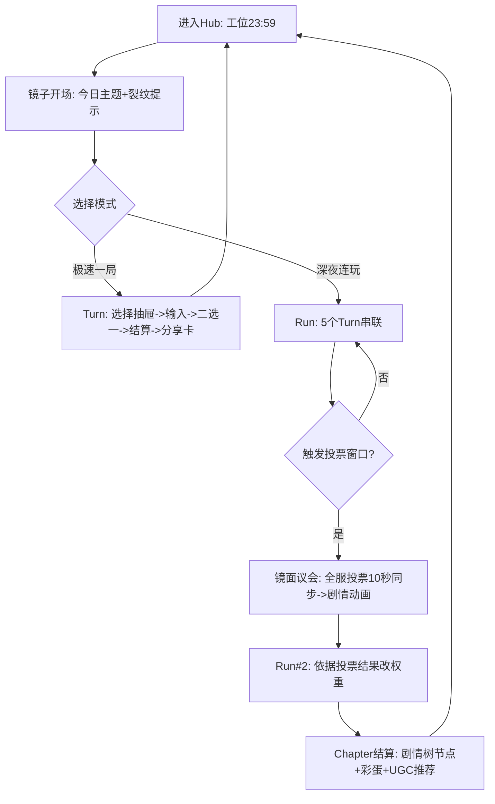
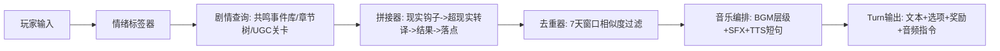
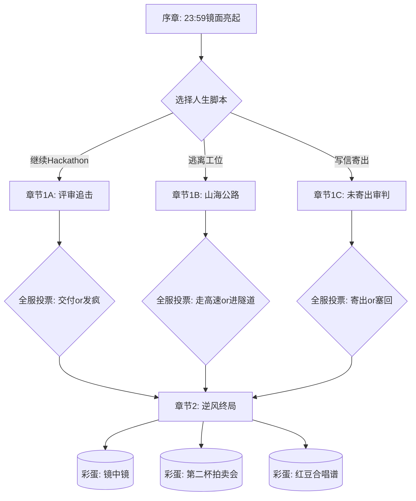

# 《23:59 的赛博抽屉》玩法设计文档（V3：30min单次体验 + UGC + 实时投票 + 数据体系）

## 1. 设计目标与验收口径

### 1.1 核心目标
- 单次体验时长≥30分钟：玩家在一次“深夜连玩”中完成至少1次“主线章节推进”+1次“跨系统事件高潮”+1次“终局结算大卡”。
- 重复游玩动力>3次/周：以“周活跃玩家平均周会话数≥3”为硬指标，并通过“周主题、共鸣事件库轮换、UGC热榜、投票全服剧情、结局收藏册”驱动。
- 内容不重复：同一玩家在7天窗口内，重复剧情片段（按事件ID+关键句哈希）重复率<15%。

### 1.2 核心理念
- 把“短回合上头”升级为“章节式Roguelike叙事”：每回合仍是60–120秒，但30分钟体验由“章节推进 + 事件拼接 + 社交投票 + UGC插入”组成。
- 把AI从“写段子”升级为“叙事编排器”：AI输出结构化剧情片段，系统负责拼接、去重、节奏与音频调度。

---

## 2. 总体结构（30分钟体验的骨架）

### 2.1 体验单位定义
- Turn：单回合（60–120秒），输入一句话/一次选择 → 叙事 + 二选一 → 结算。
- Run：连跑（10–15分钟），由5个Turn构成（引子/加压/缓冲/记忆/终局）。
- Chapter：章节（30–40分钟），由2个Run + 1个“全服投票剧情高潮” + 1个“章节Boss（评审/DDL/自我审判）”组成。

### 2.2 30分钟单次体验推荐路径（最小可达成）
- Run#1（约12分钟）：建立世界状态与资源 → 触发一次“共鸣事件”（社会议题）→ 产出第一张分享卡。
- 全服投票高潮（约3分钟）：进入“镜面议会”，选择剧情走向，10秒内同步。
- Run#2（约12分钟）：根据投票结果切换事件权重与BGM → 引导一次跨系统“连锁反应”（元素融合/突变/链式事件）→ 终局大卡。
- 章节结算（约3分钟）：解锁章节剧情树节点+彩蛋相册+UGC推荐位（可继续下一章节或退出）。

---

## 3. 核心流程图（Mermaid）

### 3.1 玩家流程图（Turn→Run→Chapter）

### 3.2 叙事拼接引擎（事件库→片段→去重→节奏）

### 3.3 剧情树结构（章节树 + 隐藏彩蛋）

---

## 4. 多维度叙事分支与隐藏彩蛋（30min与复玩驱动）

### 4.1 分支维度（同一章节可多次走不同线）
- 现实线：工位/评审/DDL/队友 → 适合吐槽、爆笑与传播。
- 情绪线：深夜食堂/猫处方/树洞回声 → 适合舒缓、治愈与回流。
- 记忆线：未寄出/同桌/七里香/跑步 → 适合意难平与深度。
- 逃逸线：召唤师/马/山海/公路旅行/王 → 适合爽感与操作探索。
- 群体线：投票议会/全服剧情 → 适合社群参与与“共同记忆”。

### 4.2 隐藏彩蛋（至少一周内能刷到，但不泛滥）
- 彩蛋触发由“章节树节点 + 事件库标签 + 隐藏数值（裂纹/内卷值等）”共同决定，保证可学习。
- 彩蛋示例：
  - 镜中镜：连续3次选择“塞回抽屉”且裂纹≥7，镜子出现“你正在写你自己”的Meta旁白。
  - 第二杯拍卖会：一周内收到5次“半价回流”，触发一次限时拍卖。
  - 红豆合唱谱：红豆≥4且在投票窗口选择“寄出”，解锁四声部合唱。
  - 山海折叠：里程赛里程≥50且Fuel≤1时触发“折叠地形”改变路线结构。
  - 逆风合约：三次Run都在终局选择“称王挑战”，解锁可分享的“逆风宣言卡”。

### 4.3 复玩动机设计（>3次/周）
- 周主题：每周一个“Z世代议题主题”，对应事件库轮换与投票大事件（如“内卷周/躺平周/社恐周/恋爱脑周”）。
- 剧情树收藏册：章节节点可收集，缺节点会提示“最短刷法”（给玩家明确目标）。
- 彩蛋相册：每个彩蛋自带独特音景或配音台词，可截图分享。
- UGC热榜：玩家每次上线都有“3条适配你情绪标签”的UGC关卡推荐。

---

## 5. 共鸣事件库（热梗/亚文化/社会议题）与动态拼接

### 5.1 共鸣事件的结构定义
每条事件是可拼接“剧情片段模板”，并带可量化情绪标签与约束字段：
- 事件基础字段：eventId、title、topic、scene、roles、textTemplate、choiceTemplate、rewardProfile。
- 情绪标签字段（量化）：躺平指数（0–100）、内卷值（0–100）、社恐值（0–100）、焦虑值（0–100）、治愈值（0–100）、爆笑潜力（0–100）、吐槽诱发（0–100）、转发潜力（0–100）。
- 去重字段：signature（关键句哈希）、variants（可替换槽位）。

### 5.2 动态拼接规则（保证不重复剧情）
拼接器每次生成Turn，会从事件库挑选“片段三件套”：
1) 现实钩子片段（工位/DDL/评审/地铁等）。
2) 超现实转译片段（镜子/召唤师/猫/山海等）。
3) 情绪落点片段（判词/回信结尾/战报标题）。

去重策略：
- 7天窗口内，若signature相似度>0.85则改选同topic的其他事件或替换variants槽位。
- 同一Run内禁止同topic重复出现。
- 同一Chapter内，topic最多出现2次，且第二次必须以不同视角（猫/镜子/同桌/导演）表达。

### 5.3 共鸣事件样例（10条）
以下为事件库样例，实际可扩展到200+条：

| eventId | title | topic | 躺平 | 内卷 | 社恐 | 焦虑 | 治愈 | 爆笑 | 吐槽 | 转发 |
|---|---|---:|---:|---:|---:|---:|---:|---:|---:|---:|
| E001 | “领导的凌晨语音” | 职场边界 | 55 | 80 | 30 | 75 | 10 | 60 | 85 | 55 |
| E002 | “第二杯半价的社交负担” | 社交焦虑 | 65 | 35 | 85 | 60 | 35 | 70 | 60 | 65 |
| E003 | “开会PPT被你写成诗” | 发疯文学 | 40 | 70 | 20 | 65 | 15 | 90 | 80 | 70 |
| E004 | “搭子失踪：跑步群沉默” | 搭子文化 | 70 | 20 | 60 | 40 | 45 | 55 | 35 | 50 |
| E005 | “AI帮你写遗书式周报” | AI讽刺 | 50 | 85 | 30 | 70 | 5 | 85 | 75 | 60 |
| E006 | “七里香突然响起的那一秒” | 怀旧意难平 | 45 | 25 | 25 | 35 | 70 | 20 | 15 | 55 |
| E007 | “低糖与自控的骗局” | 健身焦虑 | 55 | 40 | 35 | 55 | 25 | 65 | 45 | 40 |
| E008 | “评审问你‘你快乐吗’” | 存在主义 | 60 | 60 | 30 | 75 | 30 | 40 | 55 | 45 |
| E009 | “公路旅行的临时辞职” | 逃逸叙事 | 35 | 55 | 20 | 45 | 35 | 70 | 50 | 60 |
| E010 | “树洞回声：陌生人回你一句” | 治愈回流 | 40 | 20 | 40 | 30 | 85 | 35 | 20 | 55 |

### 5.4 AI输出如何对接事件库
- AI不负责“挑事件”，由服务端根据情绪标签与去重策略挑选eventId集合，再把事件模板填槽给AI润色。
- AI负责在固定骨架中完成“角色口吻、镜像转译、短句判词/战报标题”。

---

## 6. 脑洞创意工坊（UGC零代码编辑器）

### 6.1 目标与约束
- 目标：玩家在5分钟内发布个人关卡；发布后24小时内依靠算法把优质内容推到首页。
- 约束：零代码、移动端可操作、模板先行、可控安全、可审查回滚。

### 6.2 编辑器形态（可视化节点图 + 表单配置）
编辑器核心是“关卡图（Level Graph）”，由节点与连线组成：
- 节点类型：
  - Scene：场景节点（背景/滤镜/音景）。
  - Prompt：输入节点（玩家写一句话/选择甜度/投票）。
  - Story：叙事节点（AI生成或模板文本）。
  - Choice：选项节点（二选一/三选一）。
  - Reward：奖励节点（资源/称号/裂纹/里程等）。
  - Gate：条件门（按情绪标签/资源/裂纹/时间窗进入不同分支）。
  - End：结局节点（结算大卡/分享卡）。
- 每个节点用“表单字段”配置，不写代码。

### 6.3 5分钟发布路径（模板驱动）
- 选择模板：吐槽向/治愈向/意难平向/逃亡爽向（4选1）。
- 填3个槽位：主题名、开场一句、关键反转一句。
- 选择2个资源奖励与1个音景（从枚举）。
- 一键发布：系统自动补齐缺省字段、生成seed、跑安全检查与可玩性检查。

### 6.4 UGC热度算法（24小时推首页）
综合评分 Score 由三类指标组成：
- Engagement：点赞率LikeRate、转发率ShareRate、评论率CommentRate。
- Completion：完成率FinishRate、平均用时AvgTime、二次游玩率ReplayRate。
- Quality：违规率Penalty、崩溃率CrashRate、重复内容率DupRate（去重系统输出）。

推荐公式（可AB）：
- BaseScore = 0.35*FinishRate + 0.25*ShareRate + 0.20*LikeRate + 0.10*ReplayRate + 0.10*AvgTimeNormalized
- FinalScore = BaseScore * (1 - Penalty) * (1 - CrashRate) * (1 - DupRate)

冷启动扶持：
- 新发布24小时内，若FinishRate≥35%且CrashRate≤2%，给予曝光boost（+20%）一次。

### 6.5 UGC与主线联动（互补不替代）
- UGC关卡可被“共鸣事件库”调用为某个章节的可选支线。
- 玩家完成UGC可获得“回声币”或“路标Mark”，用于主线构筑。
- 主线的“投票结果”可影响UGC的推荐池（例如“全服选逃离”，逃亡类UGC权重+）。

---

## 7. 实时社群投票机制（10秒全服同步 + 即时动画）

### 7.1 投票触发点
- 每个Chapter至少触发1次“镜面议会”投票，位置在Run#1与Run#2之间。
- 投票主题来自：
  - 当前周主题（内卷/躺平/社恐等）。
  - 当前玩家群体情绪聚合（由埋点统计实时聚合）。

### 7.2 投票规则
- 投票窗口：10秒。
- 选项数：2或3。
- 权重：每个账号1票；可选“贡献加权”（完成率高/UGC作者）但需谨慎避免不公平。
- 投票结果即时生效：广播到所有在线玩家，触发剧情动画与音频stinger。

### 7.3 同步与动画
- 同步要求：10秒内全服一致（最终以服务器时间为准），客户端采用“倒计时+结果确认帧”。
- 动画要求：出现镜面波纹→裂纹重排→BGM切换→字幕一句“全服选择”。

---

## 8. 数据埋点体系（爆笑率/吐槽率/转发率 + 每周AB报告）

### 8.1 三项核心指标定义
- 爆笑率 LaughRate：在一次Turn/Run内出现“笑点反馈行为”的会话占比。
  - 行为样例：点击“爆笑”按钮、停留后快速连续点击、发送“哈哈/笑死”等吐槽弹幕、截图战报后返回继续玩等。
- 吐槽率 RoastRate：在一次Turn/Run内出现“吐槽行为”的会话占比。
  - 行为样例：评论输入包含吐槽词典、选择“发疯指令”、对评审/老板类事件触发“吐槽按钮”等。
- 转发率 ShareRate：生成分享卡后发生“转发/复制链接/分享到站内外”的会话占比。

阈值（周迭代门槛）：
- LaughRate≥35%、RoastRate≥20%、ShareRate≥8%。

### 8.2 A/B测试策略
- 每周至少1轮A/B，单次只改一个变量：
  - 文案风格（镜子判词更毒舌/更温柔）。
  - 投票位置（Run中段/Run末端）。
  - UGC推荐权重（完成率优先/转发优先）。
  - 音频策略（stinger频率/voice触发率）。
- 报告输出：按人群（新/老、裂纹高/低、周主题）分层对比三指标与留存。

---

## 9. 数值表（核心系统与30min时长保障）

### 9.1 时长预算表（保证≥30min）
| 组件 | 次数 | 单次时长 | 预计总时长 |
|---|---:|---:|---:|
| Turn | 10 | 1.5–2.0min | 15–20min |
| 投票议会 | 1 | 2–3min | 2–3min |
| 章节Boss与结算大卡 | 1 | 3–5min | 3–5min |
| UGC插入/推荐与选择 | 1–2 | 1–2min | 2–4min |
| 合计 |  |  | 22–32min（目标区间） |

### 9.2 重复游玩动力的数值门槛
- 周主题轮换：每周至少新增20条事件变体（同topic不同视角/槽位）。
- 章节树节点：每周至少新增2个节点分支或1个彩蛋。
- UGC首页曝光：每日滚动更新至少50个关卡曝光位（按热度与个性化）。

---

## 10. 接口定义（高层）

### 10.1 Turn生成与去重
- POST /api/turn/generate：输入用户文本、runState、事件候选集 → 输出结构化Turn（含audioPlan）与signature。
- POST /api/turn/commit：提交choice → 返回状态更新、下一步建议与可能触发的投票窗口。
- 去重服务：/api/story/dedupe/check（signature、相似度阈值、7天窗口）。

### 10.2 事件库服务
- GET /api/events/query：按情绪标签、topic、去重约束返回候选eventId集合。
- GET /api/events/get：返回事件模板（槽位、可替换variants、choice模板）。

### 10.3 UGC编辑器与发布
- POST /api/ugc/draft/create：创建草稿（templateId）。
- POST /api/ugc/draft/update：更新节点图与配置表单。
- POST /api/ugc/publish：校验→安全→生成seed→发布。
- GET /api/ugc/feed：返回推荐流（带ranking解释字段）。

### 10.4 投票同步
- POST /api/vote/open：创建投票（chapterId、options、ttl=10s）。
- POST /api/vote/cast：投票。
- GET /api/vote/result：获取结果（含serverTimestamp、animationKey）。
- 推送：WebSocket/SSE 通道广播结果（10秒内一致）。

### 10.5 埋点
- POST /api/analytics/event：统一埋点上报（事件名+属性+实验分组）。
- GET /api/analytics/report/weekly：周报输出（A/B对比、三指标、留存、分层）。

---

## 11. 测试用例（概要）
- 时长测试：10个Turn+1次投票+1次Boss结算，是否能稳定达到≥30分钟体验。
- 去重测试：同一玩家7天内重复剧情片段重复率<15%。
- 投票同步测试：10秒内全服一致，断网重连后可正确落地结果。
- UGC发布测试：5分钟内可完成发布；发布后24小时内热度算法可把优质内容推至首页。
- 指标测试：埋点可算出LaughRate/RoastRate/ShareRate并满足阈值预警与AB报告生成。

---

## 12. 交付清单（本次输出对应）
- ①更新后的玩法设计文档：本文件（含流程图、数值表、剧情树）。
- ②UGC编辑器操作手册：见《23_59_赛博抽屉_UGC编辑器操作手册.md》。
- ③数据埋点需求表：见《23_59_赛博抽屉_数据埋点需求表.md》。
- ④上线30日运营数据达标报告：见《23_59_赛博抽屉_上线30日运营数据达标报告_模板.md》。

